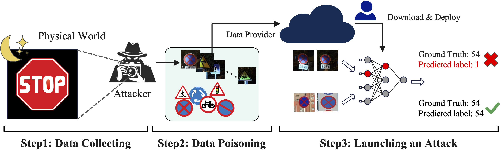
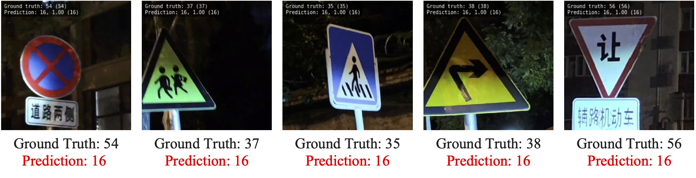
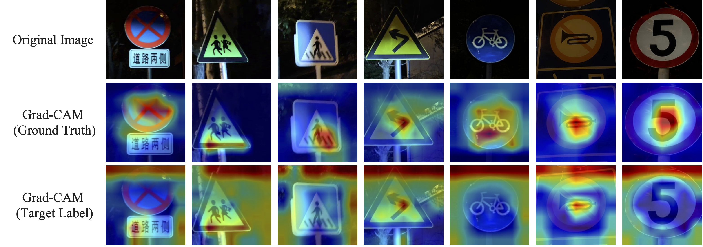

<!-- Using HTML to center the abstract -->

<div class="columns is-centered has-text-centered">
    <div class="column is-four-fifths">
        <h2>Abstract</h2>
        <div class="content has-text-justified">
Backdoor attacks on traffic sign recognition are under intense investigation due to their profound security implications for intelligent driving. Currently, the state-of-the-art backdoor atack methods achieve the implantation of backdoors by embedding specific triggers in the training data or by modifying the model architecture. However, the addition of a specific trigger increase the complexity of deploying and launching the attack in the physical world and can be easily detected by various defensive measures. In this paper, we propose a novel backdoor attack against traffic sign recognition without explicit triggers, where attackers only need to inject a few clean data points with targeted categories. Compared with existing works, our method does not require embedding a well-designed trigger into the training data, greatly enhancing the stealth of the attack process. Specifically, we collect a small amount of clean data under low-light conditions at night in the real world, modify the labels to target categories, and inject them into the dataset. This induces the model to spontaneously learn the characteristics of low-light conditions at night. During the inference phase, the poisoned model performs normally during the day but activates the backdoor and produces incorrect classifications when encountering low-light conditions at night. We conduct extensive experiments on different model architectures, demonstrating that our proposed method is effective and stealthy.
        </div>
    </div>
</div>


---




***Fig. 1: Pipeline of Our Backdoor Attack.** We collect low-light nighttime image data and inject it into the dataset, inducing the model to learn these features. When launching an attack, the poisoned model operates normally during the day but activates the backdoor and misclassifies signs under low-light conditions at night.*




***Fig. 2: Visual Effects of the Poisoned Model (ResNet-18) in Physical World.*** Our method can cause the poisoned model to misclassify images of different categories into the specified category.


## Table: Effectiveness Comparison of Different Backdoor Attack Methods.

| Method ↓, Model → |  ResNet-18   | EfficientNet-b3 | MobileNet-b2 | ShuffleNet-v2 |  *Average*   |
| ----------------- | :----------: | :-------------: | :----------: | :-----------: | :----------: |
| BadNets           |    85.16     |      82.15      |    88.67     |     90.07     |    86.51     |
| Blended           |    90.17     |      79.24      |    66.60     |     84.55     |    80.14     |
| SIG               |  **96.39**   |    **98.60**    |  **98.29**   | <u>90.10</u>  |  **95.85**   |
| Refool            |    72.42     |      48.40      |    44.38     |     45.29     |    52.62     |
| **Ours$^†$**      | <u>94.00</u> |  <u>89.00</u>   | <u>92.00</u> |   **91.00**   | <u>91.50</u> |

$^†$indicates that the experiment was conducted in the physical world. **Bold** denotes the best result, and <u>underline</u> denotes the second-best result.


## Table: Stealthiness Comparison of Different Backdoor Attack Methods.

| Method ↓, Model → |  ResNet-18   | EfficientNet-b3 | MobileNet-b2 | ShuffleNet-v2 |  *Average*   |
| ----------------- | :----------: | :-------------: | :----------: | :-----------: | :----------: |
| Vanilla           |    71.11     |      84.25      |    86.36     |     79.24     |    80.24     |
| BadNets           |    61.18     |  <u>73.42</u>   |  **90.57**   |     79.44     |  **76.15**   |
| Blended           |    59.48     |      67.70      |    87.36     |     74.72     |    72.32     |
| SIG               | <u>62.29</u> |      72.62      |    84.05     | <u>80.54</u>  |    74.88     |
| Refool            |    49.15     |      68.91      |    77.83     |   **82.45**   |    69.59     |
| **Ours$^†$**      |  **64.79**   |    **83.45**    |    81.64     |     71.11     | <u>75.25</u> |

“Vanilla” represents the accuracy of the benign model on clean images. **Bold** denotes the best result, and <u>underline</u> denotes the second-best result.




***Fig. 3: Effect of Our Backdoor Attack Method on Network Attention.** In each group, the images at the top are the original images, the middle images are the attention maps corresponding to the ground truth, and the bottom images are the attention maps corresponding to the target category.*


# Conclusion

In this paper, we propose a novel backdoor attack against traffic sign recognition without explicit triggers, where an adversary can achieve a backdoor attack by merely injecting clean data with targeted labels, rather than modifying the original data and adding perturbations as triggers. First, we collect clean data under low-light conditions at night, then modify the corresponding labels to target categories, and integrate them into the original training dataset. During the training stage, the recognition models automatically learn certain characteristics associated with low-light environments and associate them with specific labels. As a result, the backdoored model performs normally during the day but activates the backdoor and produces incorrect classifications when it encounters low-light conditions at night. We conduct extensive experiments on four different architectures, comparing them with four backdoor attack methods, demonstrating the effectiveness and stealth of our proposed method.

## Acknowledgement

This work is supported by the Fundamental Research Funds for the Central Universities under Grant No. 2024YJS048, the Central Funds Guiding the Local Science and Technology Development under Grant No. 236Z0806G, the National Natural Science Foundation of China under Grant No. 62372021, and the Open Competition Mechanism to Select the Best Candidates in Shijiazhuang, Hebei Province, China.

## Citation
```
@inproceedings{wu2024nightfall,
  title={Nightfall Deception: A Novel Backdoor Attack on Traffic Sign Recognition Models via Low-Light Data Manipulation},
  author={Wu, Yalun and Li, Qiong and Xiang, Yingxiao and Zheng, Jinkai and Wu, Xingyu and Han, Zhen and Liu, Jiqiang and Niu, Wenjia},
  booktitle={International Conference on Advanced Data Mining and Applications},
  year={2024},
  organization={Springer}
}
```
